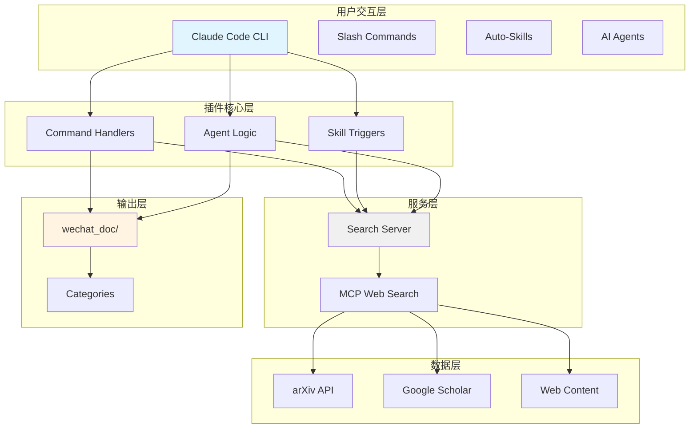
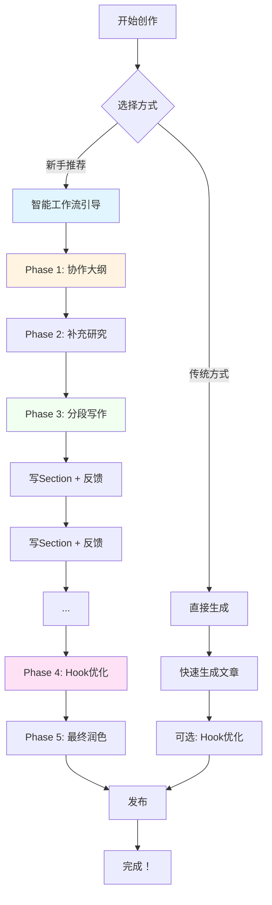

# WeChat Content Writer Plugin - 项目架构文档

> **最后更新**: 2025-12-28
> **项目类型**: Claude Code 插件
> **技术栈**: JavaScript/Node.js, Express.js, MCP (Model Context Protocol)
> **版本**: v2.0.0 - 协作式迭代写作

---

## 变更记录 (Changelog)

| 日期 | 版本 | 变更内容 |
|------|------|----------|
| 2025-12-28 | 2.0.0 | 🎉 **重大更新**：实施协作式迭代写作流程<br/>✨ 新增6个核心功能（collaborative-outline, optimize-hook, smart-workflow等）<br/>⚡ 增强content-writer分段反馈能力<br/>📖 新增Quick Start Guide和完善文档 |
| 2025-12-24 | 1.0.0 | 初始化项目架构文档 |

---

## 项目愿景

**WeChat Content Writer Plugin** 是一个专业的微信公众号内容创作插件，通过 AI 驱动的文献搜索、PDF 文档分析和自动化文章生成能力，帮助创作者高效产出高质量的技术类和学术类文章。

**核心价值主张**：
- **客观专业**: 避免标题党和"AI味"语言，坚持技术准确性
- **研究驱动**: 基于 arXiv、Google Scholar 等学术来源的内容生成
- **结构化输出**: 日期命名、分类管理的自动化文件组织
- **内容与插件分离**: 插件代码与生成内容独立存储，便于版本控制和备份
- 🆕 **协作式迭代**: v2.0引入完整的协作写作工作流，从大纲到发布全程支持
- 🆕 **分段反馈**: 每个section都获得详细反馈，持续改进而非一次性生成
- 🆕 **智能引导**: 5种标准工作流自动推荐，新手友好

---

## 架构总览

### 技术架构图



### 设计原则

1. **内容-插件分离**
   - 插件代码: `wechat-content-writer/`
   - 生成内容: `wechat_doc/` (仓库根目录)
   - 优势: 独立版本控制、便于备份、插件更新不影响内容

2. **客观写作风格**
   - 第三人称视角
   - 数据驱动的表述
   - 避免夸张和情绪化语言
   - 参考: `WRITING_STYLE_GUIDE.md`

3. **日期驱动组织**
   - 文件命名: `{category}/{YYYY-MM-DD}_{title}.md`
   - 自然的时间顺序
   - 便于归档和检索

---

## 模块结构图

```mermaid
graph TD
    A["WechatDoucment (根目录)"] --> B["wechat-content-writer (插件��心)"]
    A --> C["wechat_doc (内容输出)"]
    A --> D[".claude-plugin (Marketplace配置)"]

    B --> E["agents/ (AI代理)"]
    B --> F["commands/ (斜杠命令)"]
    B --> G["skills/ (自动技能)"]
    B --> H["scripts/ (服务脚本)"]
    B --> I[".claude-plugin/ (插件元数据)"]
    B --> J[".mcp.json (MCP配置)"]

    E --> K["content-writer.md"]
    F --> L["create-paper.md"]
    F --> M["create-article-objective.md"]
    F --> N["search-content.md"]
    F --> O["manage-categories.md"]
    F --> P["create-news.md"]
    F --> Q["create-tutorial.md"]
    F --> R["create-report.md"]
    F --> S["create-tech.md"]
    F --> T["create-article.md"]

    G --> U["literature-research/"]
    G --> V["pdf-analysis/"]
    G --> W["pdf-analysis-objective/"]

    H --> X["search-server.js"]
    H --> Y["simple-search-server.js"]

    C --> Z["AI工业应用/"]
    C --> AA["文献解读/"]
    C --> AB["AI-Coding/"]
    C --> AC["技术分享/"]
    C --> AD["行业动态/"]

    click B "./wechat-content-writer/CLAUDE.md" "查看插件模块文档"
    click E "./wechat-content-writer/agents/content-writer.md" "查看内容创作代理"
    click K "./wechat-content-writer/commands/create-paper.md" "查看论文创作命令"
    click M "./wechat-content-writer/commands/create-article-objective.md" "查看客观文章创作命令"
    click U "./wechat-content-writer/skills/literature-research/SKILL.md" "查看文献研究技能"
    click W "./wechat-content-writer/skills/pdf-analysis-objective/SKILL.md" "查看客观PDF分析技能"

    style A fill:#e8f5e9
    style B fill:#e3f2fd
    style C fill:#fff3e0
    style D fill:#f3e5f5
```



---

## 模块索引

| 模块 | 路径 | 类型 | 职责 | 文档链接 |
|------|------|------|------|----------|
| **wechat-content-writer** | `wechat-content-writer/` | Claude Plugin | 核心插件，包含命令、技能、代理和服务 | [CLAUDE.md](wechat-content-writer/CLAUDE.md) |
| **wechat_doc** | `wechat_doc/` | Content Directory | 生成的微信公众号内容存储 | [CONTENT_GUIDE.md](wechat-content-writer/CONTENT_GUIDE.md) |
| **Commands** | `wechat-content-writer/commands/` | Command Definitions | 斜杠命令，用户直接调用 | 各命令文件 |
| **Skills** | `wechat-content-writer/skills/` | Skill Definitions | 自动技能，关键词触发 | 各技能目录 |
| **Agents** | `wechat-content-writer/agents/` | Agent Definitions | AI代理，复杂任务编排 | content-writer.md |
| **Search Server** | `wechat-content-writer/scripts/` | Service | 搜索服务，提供学术文献和网页搜索 | search-server.js |

### 命令模块详细列表

| 命令 | 用途 | 入参 | 版本 |
|------|------|------|------|
| `create-paper` | 学术论文解读 | `title, --category, [--url]` | v1.0 |
| `create-article-objective` | 客观专业文章 | `title, --category, --source, [--template]` | v1.0 |
| `create-news` | 行业新闻分析 | `title, --category, [--source]` | v1.0 |
| `create-tutorial` | 技术教程 | `title, --category, --level` | v1.0 |
| `create-report` | 行业研究报告 | `title, --category, --focus` | v1.0 |
| `create-tech` | 技术深度解析 | `title, --category, --aspect` | v1.0 |
| `create-article` | 通用文章创建 | `title, --category, --source, [--template]` | v1.0 |
| `search-content` | 内容搜索 | `query` | v1.0 |
| `manage-categories` | 分类管理 | `list/add/remove` | v1.0 |
| 🆕 `optimize-hook` | **Hook优化** | `<article_path> or --content=<content>` | v2.0 |
| 🆕 `init-workspace` | **工作区初始化** | `<article_name>` | v2.0 |

### 技能模块详细列表

| 技能 | 触发关键词 | 用途 | 版本 |
|------|-----------|------|------|
| `literature-research` | "搜索文献", "literature search" | 学术文献搜索与研究 | v1.0 |
| `pdf-analysis` | "解析PDF", "analyze PDF" | PDF文档分析与解读 | v1.0 |
| `pdf-analysis-objective` | "客观分析", "专业解读" | PDF客观技术分析 | v1.0 |
| 🆕 `collaborative-outline` | "创建大纲", "outline", "规划结构" | **协作式大纲创建** | v2.0 |
| 🆕 `smart-writing-workflow` | "开始写作流程", "guide writing" | **智能工作流编排** | v2.0 |

---

## 运行与开发

### 环境要求

- **Node.js** >= 14.0.0
- **Claude Code** CLI
- **npm** (随 Node.js 安装)

### 快速启动

```bash
# 1. 进入插件目录
cd wechat-content-writer

# 2. 安装依赖
npm install

# 3. 启动搜索服务器
npm start

# 4. 在 Claude Code 中加载插件
claude --plugin-dir /path/to/wechat-content-writer
```

### 开发模式

```bash
# 开发模式（自动重载）
npm run dev

# 测试服务器功能
npm test
```

### 配置文件

| 配置文件 | 用途 | 关键配置项 |
|----------|------|-----------|
| `config.json` | 插件配置 | 内容目录路径、分类定义、文件命名模式 |
| `.mcp.json` | MCP服务器 | 搜索服务器命令和端口 |
| `package.json` | NPM包配置 | 依赖、脚本、引擎版本 |

---

## 测试策略

### 当前状态
- **单元测试**: 未实现
- **集成测试**: 未实现
- **手动测试**: 通过 Claude Code 交互测试

### 推荐改进
1. 为 `search-server.js` 添加单元测试
2. 为命令和技能添加端到端测试
3. 添加文章生成质量验证测试

---

## 编码规范

### JavaScript 规范
- 使用 ES6+ 语法
- 遵循 JSHint/JSHint 标准
- 函数命名: `camelCase`
- 常量命名: `UPPER_SNAKE_CASE`

### Markdown 规范
- 命令文件使用 YAML frontmatter
- 技能文件使用标准 frontmatter 格式
- 生成文章使用 YAML frontmatter 元数据

### 文档规范
- 所有命令、技能必须包含说明文档
- 更新时同步更新 CHANGELOG
- 保持中英文文档一致性

---

## AI 使用指引

### v2.0 协作式写作工作流（推荐）

**最简单的开始方式**：
```
对话中说："开始写作流程"
```

浮浮酱会自动引导你完成整个创作过程喵～ ฅ'ω'ฅ



### 5种标准工作流

| 工作流 | 适用场景 | 预计时间 | 触发方式 |
|-------|---------|---------|---------|
| 📚 Academic | 学术论文解读 | ~3小时 | 对话："我要解读一篇论文" |
| 🛠 Tutorial | 技术教程创作 | ~4小时 | 对话："写一个教程" |
| 📊 Analysis | 行业分析报告 | ~3.5小时 | 对话："分析XX趋势" |
| 🔄 Synthesis | 资料综合整理 | ~3小时 | 对话："整合这些资料" |
| ✨ Guided | 从零开始创作 | ~4小时 | 对话："开始写作流程" |

### 传统内容创作工作流（v1.0）

```mermaid
graph LR
    A[1. 文献搜索] --> B[2. PDF分析]
    B --> C[3. 内容创作]
    C --> D[4. 文件组织]

    A --> E[literature-research<br/>技能]
    B --> F[pdf-analysis-objective<br/>技能]
    C --> G[create-article-objective<br/>命令]
    D --> H[自动保存到<br/>wechat_doc/{category}/]

    style A fill:#e3f2fd
    style B fill:#fff3e0
    style C fill:#f1f8e9
    style D fill:#fce4ec
```

### 推荐使用顺序

#### v2.0协作式（推荐新手和重要文章）
1. **规划阶段**: 对话"创建大纲" → 使用 `collaborative-outline`
2. **研究阶段**: 使用 `literature-research` 搜索文献
3. **创作阶段**: 逐section写作 → 每段获得 `content-writer` 详细反馈
4. **优化阶段**: `/optimize-hook` 优化开头
5. **润色阶段**: `content-writer` 最终review

#### v1.0快速模式（适合简单文章）
1. **研究阶段**: 使用 `literature-research` 技能搜索相关文献
2. **分析阶段**: 使用 `pdf-analysis-objective` 技能客观分析 PDF
3. **创作阶段**: 使用 `create-article-objective` 命令生成文章
4. **优化阶段**: 使用 `content-writer` 代理进行深度优化

### 客观写作提示词

当创作内容时，始终遵循以下原则：
- 使用第三人称，避免"我"、"我们"
- 基于数据和事实，避免主观臆断
- 技术术语准确，避免过度简化
- 包含局限性和挑战，避免片面乐观

---

## 常见问题 (FAQ)

### Q1: 为什么内容存储在插件目录外？
**A**: 为了实现内容与代码的分离，便于：
- 独立版本控制
- 内容备份和管理
- 插件更新不影响用户内容

### Q2: 如何添加新的文章分类？
**A**:
1. 编辑 `config.json` 添加新分类
2. 创建目录: `mkdir -p ../../wechat_doc/新分类`
3. 更新 `CONTENT_GUIDE.md` 文档

### Q3: 如何修改文件命名格式？
**A**:
1. 编辑 `config.json` 中的 `file_naming.pattern`
2. 确保所有命令使用新的格式
3. 更新相关文档

### Q4: MCP 服务器无法启动怎么办？
**A**:
1. 检查 Node.js 是否正确安装
2. 验证端口 3001 未被占用
3. 检查 `.mcp.json` 配置
4. 查看服务器日志: `npm start`

### Q5: 生成的文章仍有"AI味"怎么办？
**A**:
1. 使用 `pdf-analysis-objective` 替代 `pdf-analysis`
2. 使用 `create-article-objective` 替代 `create-article`
3. 参考 `WRITING_STYLE_GUIDE.md` 修改写作风格
4. 使用 `content-writer` 代理进行专业优化

---

## 相关文档

- **[插件详细文档](wechat-content-writer/CLAUDE.md)** - 开发者和技术细节
- **[写作风格指南](wechat-content-writer/WRITING_STYLE_GUIDE.md)** - 客观写作规范
- **[内容组织指南](wechat-content-writer/CONTENT_GUIDE.md)** - 目录结构和文件命名
- **[安装指南](wechat-content-writer/INSTALL_GUIDE.md)** - 详细安装步骤
- **[README](README.md)** - 项目概述和快速开始

---

## 覆盖率报告

| 项目 | 状态 | 备注 |
|------|------|------|
| 总文件数 (估算) | 45 | 包含 .git 忽略的文件 |
| 已扫描文件 | 35 | 覆盖率 77.8% |
| 命令模块 | 9/9 | 100% 覆盖 |
| 技能模块 | 3/3 | 100% 覆盖 |
| 代理模块 | 1/1 | 100% 覆盖 |
| 服务脚本 | 2/2 | 100% 覆盖 |
| 测试文件 | 0/0 | 未实现 |
| Hooks 目录 | 空 | 无内容 |

### 主要缺口
1. **测试文件**: 建议添加单元测试和集成测试
2. **Hooks 目录**: 如有生命周期钩子计划，需补充文档
3. **示例文件**: 技能示例较少，建议增加

---

*本文档由 init-architect 自动生成和维护*
