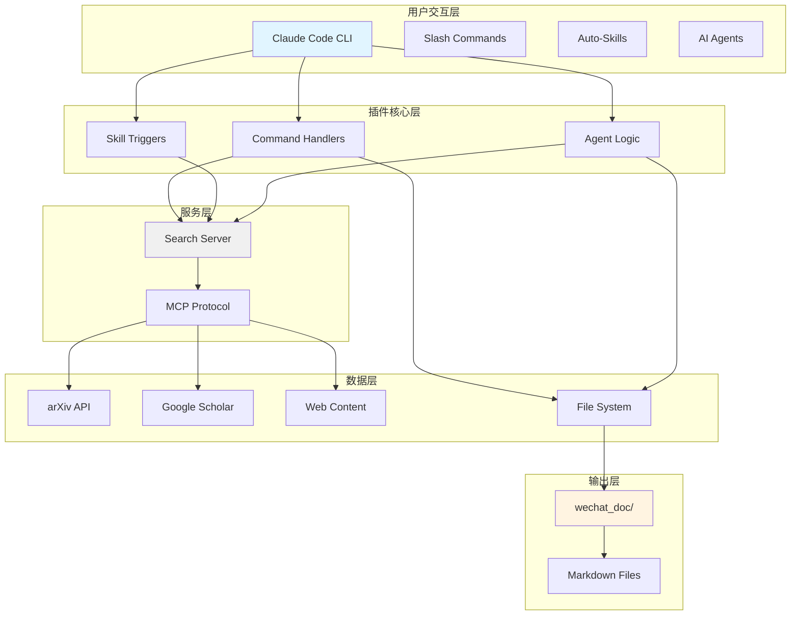
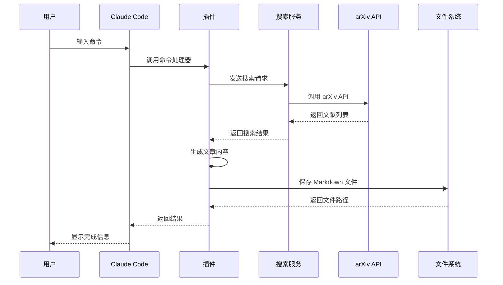
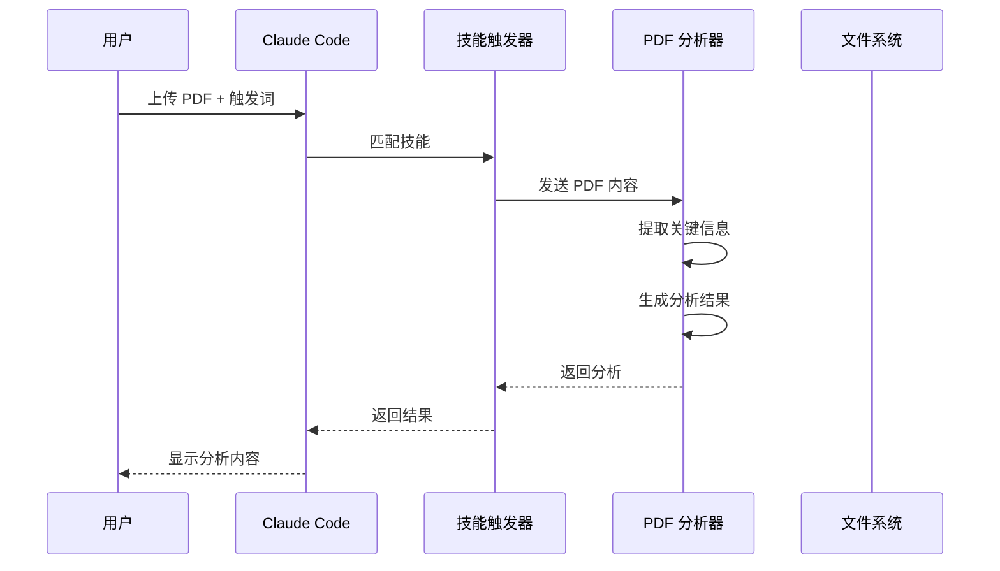

# 架构设计

本文档详细说明了 WeChat Content Writer 插件的架构设计和技术实现。

## 目录

- [总体架构](#总体架构)
- [分层设计](#分层设计)
- [核心组件](#核心组件)
- [数据流](#数据流)
- [设计原则](#设计原则)

## 总体架构

### 系统架构图



### 技术栈

| 层级 | 技术 | 用途 |
|------|------|------|
| **运行时** | Node.js >= 14.0.0 | JavaScript 运行环境 |
| **Web 框架** | Express.js | 搜索服务器 |
| **协议** | MCP (Model Context Protocol) | Claude 通信 |
| **HTTP 客户端** | Axios | 外部 API 调用 |
| **DOM 解析** | jsdom | HTML 内容解析 |
| **插件系统** | Claude Code Plugin | 插件框架 |

## 分层设计

### 1. 用户交互层

负责与用户直接交互，接收输入和展示结果。

#### 组件

| 组件 | 说明 | 文件位置 |
|------|------|----------|
| **Slash Commands** | 用户直接调用的命令 | `commands/*.md` |
| **Auto-Skills** | 关键词触发的技能 | `skills/*/SKILL.md` |
| **AI Agents** | 复杂任务编排代理 | `agents/*.md` |

#### 命令规范

```yaml
---
command: create-paper
description: 创建学术论文解读文章
parameters:
  - name: title
    type: string
    required: true
  - name: --category
    type: string
    required: true
  - name: --url
    type: string
    required: false
---
```

### 2. 插件核心层

处理业务逻辑，协调各组件完成任务。

#### 核心功能

- **命令解析**: 解析用户输入的命令参数
- **技能触发**: 匹配关键词触发对应技能
- **任务编排**: 代理协调多个任务执行
- **内容生成**: 基于模板生成文章内容

#### 配置管理

```javascript
// config.json 结构
{
  version: "1.0.0",
  plugin_name: "wechat-content-writer",
  content_directories: {
    base_path: "../../wechat_doc",
    categories: { /* ... */ }
  },
  file_naming: {
    pattern: "{category}/{date}_{title}.md",
    date_format: "YYYY-MM-DD"
  }
}
```

### 3. 服务层

提供搜索和分析能力的外部服务接口。

#### 搜索服务器

Express.js 服务器，提供以下端点：

| 端点 | 方法 | 功能 |
|------|------|------|
| `/health` | GET | 健康检查 |
| `/search/academic` | POST | 学术文献搜索 |
| `/search/web` | POST | 通用网页搜索 |
| `/analyze/content` | POST | 内容分析 |

#### MCP 协议

通过 Model Context Protocol 与 Claude Code 通信：

```json
// .mcp.json
{
  "mcpServers": {
    "web-search": {
      "command": "node",
      "args": ["${CLAUDE_PLUGIN_ROOT}/scripts/simple-search-server.js"],
      "env": { "PORT": "3001" }
    }
  }
}
```

### 4. 数据层

数据存储和外部数据源。

#### 外部数据源

| 数据源 | 用途 | 访问方式 |
|--------|------|----------|
| **arXiv** | 学术论文 | API |
| **Google Scholar** | 学术文献 | API (需密钥) |
| **Web Content** | 网页内容 | HTTP + jsdom |

#### 本地存储

```
wechat_doc/               # 内容输出
├── AI工业应用/
├── 文献解读/
├── AI-Coding/
├── 技术分享/
└── 行业动态/

plugin/                   # 插件代码
├── commands/             # 命令定义
├── skills/               # 技能定义
├── agents/               # 代理定义
└── scripts/              # 服务脚本
```

## 核心组件

### Command Handler

命令处理器负责解析和执行用户命令。

```javascript
// 命令处理流程
function handleCommand(command, args) {
  // 1. 参数验证
  if (!validateArgs(command, args)) {
    throw new Error('Invalid arguments');
  }

  // 2. 获取模板
  const template = getTemplate(command);

  // 3. 获取内容
  const content = fetchContent(args.source, args.query);

  // 4. 生成文章
  const article = generateArticle(template, content, args);

  // 5. 保存文件
  saveArticle(article, args.category);

  return article;
}
```

### Skill Trigger

技能触发器检测用户输入并触发相应技能。

```javascript
// 技能匹配逻辑
const skillTriggers = {
  'literature-research': [
    '搜索文献',
    '查找学术资料',
    'literature search',
    'latest research'
  ],
  'pdf-analysis': [
    '解析PDF',
    '解读文档',
    'analyze PDF'
  ],
  'pdf-analysis-objective': [
    '客观分析',
    '专业解读'
  ]
};

function matchSkill(userInput) {
  for (const [skill, triggers] of Object.entries(skillTriggers)) {
    for (const trigger of triggers) {
      if (userInput.includes(trigger)) {
        return skill;
      }
    }
  }
  return null;
}
```

### Agent Logic

AI 代理负责复杂任务的编排和优化。

```javascript
// 代理工作流程
async function agentWorkflow(task) {
  // 1. 任务分解
  const subtasks = decomposeTask(task);

  // 2. 顺序执行
  const results = [];
  for (const subtask of subtasks) {
    const result = await executeSubtask(subtask);
    results.push(result);
  }

  // 3. 结果整合
  const finalResult = integrateResults(results);

  // 4. 质量检查
  if (validateResult(finalResult)) {
    return finalResult;
  } else {
    // 重新生成或请求优化
    return await optimizeResult(finalResult);
  }
}
```

### Search Server

搜索服务器提供文献和网页搜索能力。

```javascript
// 服务端点实现
app.post('/search/academic', async (req, res) => {
  const { query, limit = 10 } = req.body;

  // 并行搜索多个数据源
  const [arxivResults, scholarResults] = await Promise.all([
    searchArxiv(query, limit),
    searchGoogleScholar(query, limit)
  ]);

  // 合并去重
  const results = combineAndRankResults(arxivResults, scholarResults);

  res.json({ query, results });
});
```

## 数据流

### 文章生成流程



### PDF 分析流程



## 设计原则

### 1. 内容-插件分离

**设计决策**: 将插件代码和生成内容分离存储

**优势**:
- 独立版本控制
- 便于内容备份
- 插件更新不影响用户内容

**实现**:
```
wechat-content-writer/    # 插件代码
wechat_doc/               # 生成内容
```

### 2. 客观写作风格

**设计决策**: 强制使用客观、中立的写作风格

**优势**:
- 提高内容专业性
- 避免 AI 味语言
- 增强可信度

**实现**:
- 第三人称约束
- 数据驱动表述
- 包含局限性说明

### 3. 模块化设计

**设计决策**: 命令、技能、代理独立实现

**优势**:
- 易于扩展
- 便于维护
- 可独立测试

**实现**:
```
commands/    # 命令模块
skills/      # 技能模块
agents/      # 代理模块
```

### 4. 可配置性

**设计决策**: 所有行为可通过配置文件修改

**优势**:
- 适应不同需求
- 无需修改代码
- 便于个性化

**实现**:
```json
{
  "content_directories": { /* 可配置 */ },
  "file_naming": { /* 可配置 */ },
  "mcp_servers": { /* 可配置 */ }
}
```

## 扩展点

### 添加新命令

1. 在 `commands/` 创建新的 Markdown 文件
2. 定义 YAML frontmatter
3. 实现命令处理逻辑
4. 更新配置

### 添加新技能

1. 在 `skills/` 创建新目录
2. 创建 `SKILL.md` 文件
3. 定义触发关键词
4. 实现技能逻辑

### 添加新数据源

1. 在 `scripts/search-server.js` 添加新的搜索函数
2. 注册到 `SEARCH_CONFIG`
3. 更新合并逻辑

## 下一步

- [搜索服务 API](./api.md) - 详细 API 文档
- [配置说明](./configuration.md) - 完整配置参考
- [插件开发](./plugin-development.md) - 开发者指南
