# 快速开始

欢迎使用 WeChat Content Writer 插件！本指南将帮助你在 5 分钟内完成安装并创作第一篇文章。

## 系统要求

在开始之前，请确保你的环境满足以下要求：

| 要求 | 最低版本 | 推荐版本 |
|------|----------|----------|
| Node.js | 14.0.0 | 18.0.0+ |
| npm | 6.0.0 | 9.0.0+ |
| Claude Code | 最新版 | 最新版 |

## 安装步骤

### 1. 克隆或下载插件

```bash
# 克隆仓库
git clone https://github.com/bahayonghang/wechat-content-writer.git

# 或下载 ZIP 文件并解压
```

### 2. 安装依赖

```bash
cd wechat-content-writer
npm install
```

### 3. 启动搜索服务

插件需要运行搜索服务来提供文献搜索能力：

```bash
# 生产模式启动
npm start

# 或使用开发模式（自动重载）
npm run dev
```

服务将在 `http://localhost:3001` 启动。

### 4. 验证服务

```bash
# 检查服务健康状态
curl http://localhost:3001/health

# 预期响应
# {"status":"healthy","timestamp":"2024-12-24T..."}
```

### 5. 加载插件到 Claude Code

```bash
# 方式一：通过参数指定
claude --plugin-dir /path/to/wechat-content-writer

# 方式二：设置环境变量（推荐）
export CLAUDE_PLUGIN_DIR=/path/to/wechat-content-writer
claude
```

## 创作第一篇文章

### 方式一：学术论文解读

```
/create-paper "多模态大语言模型研究进展" --category 文献解读
```

插件将自动：
1. 搜索相关学术文献
2. 分析论文内容
3. 生成专业的解读文章
4. 保存到 `wechat_doc/文献解读/` 目录

### 方式二：使用技能触发

```
搜索文献：多模态大语言模型的最新研究
```

插件将自动触发 `literature-research` 技能，为你搜索和整理相关文献。

### 方式三：基于 PDF 分析

```
客观分析：[上传 PDF 文件]
```

插件将使用 `pdf-analysis-objective` 技能进行专业的 PDF 分析。

## 内容输出位置

生成的文章会自动保存到项目根目录的 `wechat_doc/` 文件夹：

```
wechat_doc/
├── AI工业应用/          # 工业AI应用案例
├── 文献解读/            # 学术论文解读
├── AI-Coding/           # AI编程技术
├── 技术分享/            # 通用技术分享
└── 行业动态/            # 行业新闻趋势
```

文件命名格式：`{category}/{YYYY-MM-DD}_{title}.md`

## 推荐工作流

```mermaid
graph LR
    A[1. 文献搜索] --> B[2. PDF分析]
    B --> C[3. 内容创作]
    C --> D[4. 文件组织]

    style A fill:#e3f2fd
    style B fill:#fff3e0
    style C fill:#f1f8e9
    style D fill:#fce4ec
```



### 步骤详解

1. **文献搜索**
   ```
   搜索文献：深度学习在计算机视觉中的应用
   ```

2. **PDF 分析**
   ```
   客观分析：[上传找到的 PDF 论文]
   ```

3. **内容创作**
   ```
   /create-article-objective "深度学习在CV领域的最新突破" --category AI工业应用 --source research
   ```

4. **文章保存**
   - 自动保存到 `wechat_doc/AI工业应用/2024-12-24_深度学习在CV领域的最新突破.md`

## 下一步

- 📖 阅读完整 [命令参考](./commands.md)
- 🎨 了解 [写作风格指南](./writing-style.md)
- 🔧 查看 [配置说明](../development/configuration.md)
- 💡 探索 [技能使用](./skills.md)

## 常见问题

<details>
<summary>服务启动失败，提示端口被占用怎么办？</summary>

可以通过环境变量修改端口：

```bash
# Windows
set PORT=3002
npm start

# Linux/Mac
PORT=3002 npm start
```

然后更新 `.mcp.json` 中的端口号。
</details>

<details>
<summary>插件无法被 Claude Code 识别？</summary>

检查以下几点：

1. 确认 `wechat-content-writer/.claude-plugin/plugin.json` 文件存在
2. 确认插件目录路径正确
3. 使用 `--plugin-dir` 绝对路径
4. 查看 Claude Code 日志获取详细错误信息
</details>

<details>
<summary>如何查看已生成的文章？</summary>

文章保存在 `wechat_doc/` 目录，可以使用：

```bash
# 列出所有生成的文章
find wechat_doc -name "*.md" -type f

# 查看最新文章
ls -lt wechat_doc/*/*.md | head -5
```
</details>
