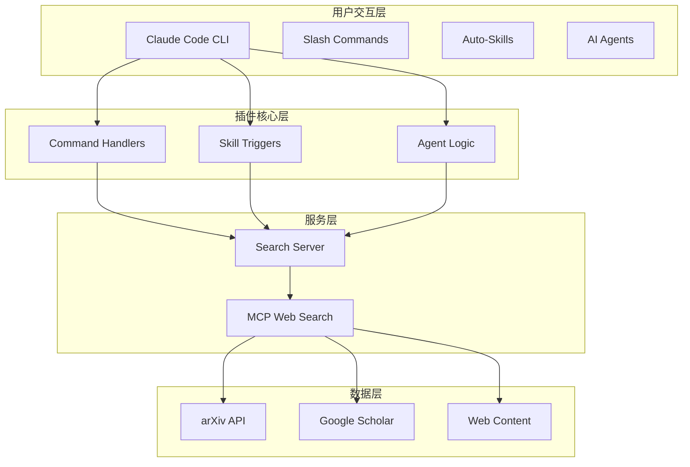

## 使用场景

### 学术研究者
快速检索最新论文，自动生成学术解读文章

### 技术博主
基于论文和技术文档，创作深度技术分析内容

### 行业分析师
整合行业资讯，生成专业的行业研究报告

### 内容创作者
提高创作效率，保证内容的专业性和客观性

## 技术架构

## 快速体验

<button title="Copy Code" class="copy"></button>bash<pre class="shiki shiki-themes github-light github-dark vp-code"><code># 1. 安装依赖
cd wechat-content-writer && npm install

# 2. 启动搜索服务
npm start

# 3. 在 Claude Code 中使用
/create-paper "多模态大语言模型研究" --category 文献解读</code></pre>

## 统计数据

| 项目 | 数量 |
|------|------|
| 命令 | 9 个 |
| 技能 | 3 个 |
| AI 代理 | 1 个 |
| 文章模板 | 6 种 |
| 内容分类 | 5 类 |

## 许可证

[MIT License](https://opensource.org/licenses/MIT)
