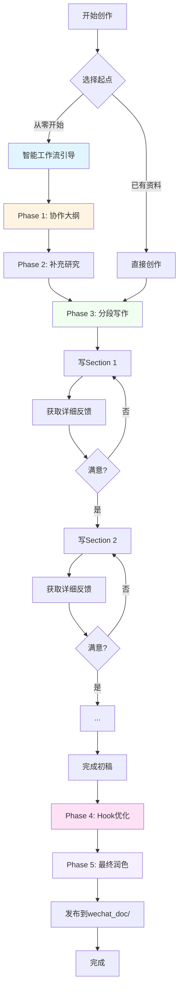

# WeChat Content Writer Plugin - 模块文档

[根目录](../CLAUDE.md) > **wechat-content-writer**

---

> **最后更新**: 2025-12-28
> **模块类型**: Claude Code Plugin
> **技术栈**: JavaScript/Node.js, Express.js, MCP
> **版本**: 2.0.0 - 协作式迭代写作

---

## 变更记录 (Changelog)

| 日期 | 版本 | 变更内容 |
|------|------|----------|
| 2025-12-28 | 2.0.0 | 🎉 **重大更新**：实施协作式迭代写作流程 <br/>✨ 新增：collaborative-outline skill（协作大纲创建）<br/>✨ 新增：optimize-hook command（Hook优化）<br/>✨ 新增：smart-writing-workflow skill（智能工作流）<br/>✨ 新增：init-workspace command（工作区管理）<br/>⚡ 增强：content-writer agent 分段反馈能力<br/>⚡ 新增：双写作模式配置（客观/个性化）|
| 2025-12-24 | 1.0.0 | 初始化模块架构文档，添加面包屑导航 |

---

## 模块职责

**wechat-content-writer** 是核心插件模块，负责：

1. **命令处理**: 提供 11 个斜杠命令，覆盖不同类型的内容创作需求（新增2个）
2. **技能触发**: 5 个自动技能，根据用户意图智能触发（新增2个）
3. **AI 代理**: 内容创作代理，支持复杂任务的编排和优化（增强分段反馈）
4. **搜索服务**: 基于 Express 的搜索服务器，提供学术文献和网页搜索能力
5. **配置管理**: 插件配置、MCP 服务器配置、内容目录管理、写作模式管理
6. **工作区管理**: 🆕 提供迭代写作工作区，支持版本控制和反馈追踪
7. **工作流编排**: 🆕 智能写作流程引导，从大纲到发布的完整支持

---

## 入口与启动

### 插件入口

| 入口文件 | 类型 | 说明 |
|----------|------|------|
| `.claude-plugin/plugin.json` | Plugin Metadata | Claude Code 插件定义 |
| `.mcp.json` | MCP Config | MCP 服务器配置 |
| `package.json` | NPM Package | Node.js 包定义 |

### 服务启动

```bash
# 生产模式
npm start          # 启动 search-server.js (端口 3001)

# 开发模式
npm run dev        # 使用 nodemon 自动重载

# 测试
npm test           # 运行测试脚本
```

### 服务端点

| 端点 | 方法 | 功能 |
|------|------|------|
| `/health` | GET | 健康检查 |
| `/search/academic` | POST | 学术文献搜索 (arXiv + Google Scholar) |
| `/search/web` | POST | 通用网页搜索 |
| `/analyze/content` | POST | 内容分析 |

---

## 对外接口

### 命令接口

| 命令 | 用途 | 参数 | 版本 |
|------|------|------|------|
| `create-paper` | 学术论文解读 | `title, --category, [--url]` | v1.0 |
| `create-article-objective` | 客观专业文章 | `title, --category, --source, [--template]` | v1.0 |
| `create-news` | 行业新闻分析 | `title, --category, [--source]` | v1.0 |
| `create-tutorial` | 技术教程 | `title, --category, --level` | v1.0 |
| `create-report` | 行业研究报告 | `title, --category, --focus` | v1.0 |
| `create-tech` | 技术深度解析 | `title, --category, --aspect` | v1.0 |
| `create-article` | 通用文章创建 | `title, --category, --source, [--template]` | v1.0 |
| `search-content` | 内容搜索 | `query` | v1.0 |
| `manage-categories` | 分类管理 | `list/add/remove` | v1.0 |
| 🆕 `optimize-hook` | **Hook优化** | `<article_path> or --content=<content>` | v2.0 |
| 🆕 `init-workspace` | **工作区初始化** | `<article_name>` | v2.0 |

### 技能接口

| 技能 | 触发关键词 | 核心能力 | 版本 |
|------|-----------|---------|------|
| `literature-research` | "搜索文献", "literature search" | 研究文献汇总 | v1.0 |
| `pdf-analysis` | "解析PDF", "analyze PDF" | 通俗解读内容 | v1.0 |
| `pdf-analysis-objective` | "客观分析", "专业解读" | 专业技术分析 | v1.0 |
| 🆕 `collaborative-outline` | "创建大纲", "outline", "规划结构" | **协作式大纲创建** | v2.0 |
| 🆕 `smart-writing-workflow` | "开始写作流程", "guide writing" | **智能工作流编排** | v2.0 |

### 代理接口

| 代理 | 用途 | 核心增强 | 版本 |
|------|------|---------|------|
| `content-writer` | 综合内容创作 | ⚡ **新增分段反馈能力**<br/>- Section-by-Section Feedback<br/>- 5维度评分<br/>- 具体Line Edits<br/>- 双模式适配 | v2.0 |

---

## 关键依赖与配置

### 运行时依赖

```json
{
  "express": "^4.18.2",    // Web 服务器框架
  "cors": "^2.8.5",        // 跨域支持
  "axios": "^1.6.2",       // HTTP 客户端
  "jsdom": "^23.0.1"       // DOM 解析
}
```

### 开发依赖

```json
{
  "nodemon": "^3.0.2"      // 开发时自动重载
}
```

### 配置文件结构

#### `config.json`
```json
{
  "version": "2.0.0",
  "content_directories": {
    "base_path": "../../wechat_doc",
    "categories": {
      "AI工业应用": "AI工业应用",
      "文献解读": "文献解读",
      "AI-Coding": "AI-Coding",
      "技术分享": "技术分享",
      "行业动态": "行业动态"
    }
  },
  "file_naming": {
    "pattern": "{category}/{date}_{title}.md",
    "date_format": "YYYY-MM-DD"
  },
  "auto_create_directories": true,
  "content_validation": true,
  "writing_modes": {
    "default_mode": "objective_professional",
    "modes": {
      "objective_professional": {
        "description": "客观专业模式（默认）",
        "tone": "third-person",
        "style": "neutral, data-driven",
        "focus": ["technical_accuracy", "objectivity", "evidence_support"]
      },
      "collaborative_personal": {
        "description": "协作个性化模式",
        "tone": "user-defined (flexible)",
        "style": "preserve author voice",
        "focus": ["author_voice", "engagement", "relatability"]
      }
    },
    "mode_selection": {
      "by_category": {
        "文献解读": "objective_professional",
        "行业动态": "objective_professional",
        "技术分享": "collaborative_personal",
        "AI-Coding": "collaborative_personal"
      }
    }
  },
  "workspace_mode": {
    "enabled": true,
    "auto_create": false,
    "location": "../../wechat_writing_workspace",
    "structure": {
      "outline": "outline.md",
      "research": "research.md",
      "drafts": "draft-v{number}.md",
      "feedback": "feedback.md",
      "final": "final.md"
    }
  }
}
```

#### `.mcp.json`
```json
{
  "mcpServers": {
    "web-search": {
      "command": "node",
      "args": ["${CLAUDE_PLUGIN_ROOT}/scripts/simple-search-server.js"],
      "env": { "PORT": "3001" }
    }
  }
}
```

### 环境变量

| 变量 | 说明 | 默认值 |
|------|------|--------|
| `PORT` | 搜索服务器端口 | `3001` |
| `SEARCH_API_KEY` | Google Scholar/SerpAPI 密钥 | - |

---

## 协作式写作工作流 (v2.0 核心特性)

### 完整工作流程图



### 工作流核心组件

#### 1. 智能工作流引导 (`smart-writing-workflow`)
- 自动识别创作需求
- 推荐5种标准工作流：
  - 📚 Academic Workflow - 学术论文解读 (~3h)
  - 🛠 Tutorial Workflow - 教程创作 (~4h)
  - 📊 Analysis Workflow - 分析报告 (~3.5h)
  - 🔄 Synthesis Workflow - 资料综合 (~3h)
  - ✨ Guided Creation - 引导式创作 (~4h)

#### 2. 协作式大纲 (`collaborative-outline`)
- 交互式问答明确需求
- 3种文章模板（学术/技术/教程）
- 自动识别研究缺口
- 生成Research To-Do清单

#### 3. 分段反馈机制 (`content-writer` agent)
- Section-by-Section详细反馈
- 5维度评分（Clarity/Flow/Evidence/Style/Accuracy）
- 具体Line Edits建议
- 迭代式改进支持

#### 4. Hook优化 (`optimize-hook`)
- 3种Hook选项（数据驱动/问题式/场景故事）
- 多维度分析评分
- 智能推荐最佳选项

#### 5. 工作区管理 (`init-workspace`)
- 标准化文件组织
- 版本控制支持
- 反馈历史追踪

### 双写作模式

| 模式 | 适用场景 | 特点 |
|------|---------|------|
| **Objective Professional** | 学术论文、技术分析、行业报告 | 第三人称、数据驱动、客观中立 |
| **Collaborative Personal** | 个人博客、技术分享、经验总结 | 保留作者声音、允许个人见解 |

模式自动根据分类和模板选择，也可手动指定。

---

## 数据模型

### 文章元数据模型

```yaml
---
title: "文章标题"
category: "分类名称"
date: "YYYY-MM-DD"
source: "search|pdf|research|manual"
template: "模板类型"
tags: ["标签1", "标签2"]
estimated_read_time: "阅读时间（分钟）"
references: ["引用来源"]
---
```

### 内容分类模型

```
wechat_doc/
├── AI工业应用/          # 工业AI应用案例
├── 文献解读/            # 学术论文解读
├── AI-Coding/           # AI编程技术
├── 技术分享/            # 通用技术分享
└── 行业动态/            # 行业新闻趋势
```

### 文件命名模型

```
{category}/{YYYY-MM-DD}_{sanitized_title}.md
```

**示例**:
```
文献解读/2025-12-24_基于多模态融合的FeO浓度实时预测技术研究.md
```

---

## 测试与质量

### 当前测试状态

| 类型 | 状态 | 说明 |
|------|------|------|
| 单元测试 | 未实现 | 建议为搜索服务器添加测试 |
| 集成测试 | 未实现 | 建议为命令/技能添加 E2E 测试 |
| 手动测试 | 部分 | 通过 Claude Code 交互验证 |

### 质量保证清单

#### 内容质量
- [ ] 使用客观、中立的第三人称表达
- [ ] 基于可靠来源的数据和事实
- [ ] 包含必要的局限性说明
- [ ] 遵循 `WRITING_STYLE_GUIDE.md` 规范

#### 技术质量
- [ ] 搜索服务器响应正常
- [ ] MCP 工具可正常调用
- [ ] 文件路径正确解析
- [ ] 错误处理和提示清晰

#### 文档质量
- [ ] 命令文档包含参数说明
- [ ] 技能文档包含触发条件
- [ ] 示例代码可执行
- [ ] 变更记录更新

---

## 常见问题 (FAQ)

### Q1: 插件无法被 Claude Code 识别
**A**: 检查以下项：
1. `.claude-plugin/plugin.json` 文件存在且格式正确
2. 插件目录路径正确
3. 使用 `--plugin-dir` 参数指定路径

### Q2: 搜索服务无法启动
**A**:
1. 检查 Node.js 版本 >= 14.0.0
2. 确认端口 3001 未被占用
3. 运行 `npm install` 安装依赖
4. 查看错误日志

### Q3: 生成的文章仍有"AI味"
**A**:
1. 使用 `pdf-analysis-objective` 替代 `pdf-analysis`
2. 使用 `create-article-objective` 替代 `create-article`
3. 参考 `WRITING_STYLE_GUIDE.md` 检查用词
4. 确保使用第三人称视角

### Q4: 内容目录路径错误
**A**:
1. 检查 `config.json` 中 `base_path` 配置
2. 确认使用相对路径 `../../wechat_doc`
3. 验证目录是否存在

### Q5: 如何添加新的文章分类？
**A**:
1. 编辑 `config.json` 添加新分类
2. 创建目录: `mkdir -p ../../wechat_doc/新分类`
3. 更新 `CONTENT_GUIDE.md` 文档

### Q6: 如何使用新的协作式写作工作流？（v2.0新增）
**A**:
最简单的方式是使用智能工作流引导：
```
直接对话："开始写作流程"
```
浮浮酱会自动引导你完成从大纲到发布的全过程。

### Q7: 什么时候使用工作区模式？（v2.0新增）
**A**:
**推荐使用工作区**：
- 重要文章需要多次迭代
- 想保留创作过程和反馈历史
- 需要版本控制

**不使用工作区**：
- 快速简单的文章
- 一次性创作
- 不需要版本管理

创建工作区：
```bash
/wechat-content-writer:init-workspace "article_name"
```

### Q8: 如何优化文章开头？（v2.0新增）
**A**:
使用Hook优化命令：
```bash
/wechat-content-writer:optimize-hook "article.md"
```
浮浮酱会提供3种不同类型的Hook选项：
- 数据驱动型（适合技术文章）
- 问题引导型（适合教程）
- 场景故事型（适合案例）

### Q9: 双写作模式如何选择？（v2.0新增）
**A**:
系统会自动根据分类选择：
- **文献解读、行业动态** → 客观专业模式
- **技术分享、AI-Coding** → 协作个性化模式

也可以手动指定模式（在创建文章时）。

---

## 相关文件清单

### 核心文件
```
wechat-content-writer/
├── .claude-plugin/plugin.json     # 插件元数据
├── .mcp.json                      # MCP 服务器配置
├── config.json                    # 插件配置
├── package.json                   # NPM 包配置
├── CLAUDE.md                      # 本文档
├── README.md                      # 项目概述
├── CONTENT_GUIDE.md               # 内容组织指南
├── WRITING_STYLE_GUIDE.md         # 写作风格指南
├── INSTALL_GUIDE.md               # 安装指南
├── install.sh                     # Unix 安装脚本
├── install.ps1                    # Windows 安装脚本
├── agents/content-writer.md       # 内容创作代理
├── commands/                      # 命令目录 (9个命令)
├── skills/                        # 技能目录 (3个技能)
└── scripts/                       # 服务脚本 (2个脚本)
```

### 命令文件
```
commands/
├── create-paper.md                # 学术论文解读
├── create-article-objective.md    # 客观文章创建
├── create-news.md                 # 新闻分析
├── create-tutorial.md             # 教程创作
├── create-report.md               # 报告生成
├── create-tech.md                 # 技术解析
├── create-article.md              # 通用文章
├── search-content.md              # 内容搜索
├── manage-categories.md           # 分类管理
├── 🆕 optimize-hook.md            # Hook优化命令
└── 🆕 init-workspace.md           # 工作区初始化
```

### 技能文件
```
skills/
├── literature-research/
│   └── SKILL.md                   # 文献研究技能
├── pdf-analysis/
│   └── SKILL.md                   # PDF 解读技能
├── pdf-analysis-objective/
│   └── SKILL.md                   # 客观 PDF 分析技能
├── 🆕 collaborative-outline/
│   └── SKILL.md                   # 协作式大纲创建
└── 🆕 smart-writing-workflow/
    └── SKILL.md                   # 智能写作工作流
```

### 服务脚本
```
scripts/
├── search-server.js               # 主搜索服务器
├── simple-search-server.js        # 简化搜索服务器
└── test-plugin.js                 # 测试脚本
```

---

## 使用指南

### 快速开始（新用户）

**第一次使用？跟随智能工作流喵～**
```
直接对话："开始写作流程"
```

**传统方式（一次性生成）**
```bash
/wechat-content-writer:create-article-objective "文章标题" --category="技术分享" --source="research"
```

### 推荐工作流（v2.0）

#### 场景1：学术论文解读


#### 场景2：技术教程创作


#### 场景3：快速创作（跳过工作流）
```bash
# 直接使用命令创建
/wechat-content-writer:create-tutorial "Docker多阶段构建" --category="AI-Coding" --level="intermediate"
```

### 核心功能使用示例

#### 1. 创建大纲
```
用户："我想写一篇关于Transformer优化的文章，帮我创建大纲"
浮浮酱：[触发 collaborative-outline skill]
         好的喵～浮浮酱帮主人创建大纲～先问几个问题：
         1. 主要讲哪方面的优化？（注意力机制/计算效率/模型压缩）
         2. 目标读者是？（研究人员/工程师/学生）
         ...
```

#### 2. 分段写作反馈
```
用户：[写完Introduction] 请review这一段
浮浮酱：[content-writer agent提供详细反馈]
         # 📋 Feedback: Introduction
         
         ## ✓ What Works Well
         - 背景描述清晰，技术术语使用准确
         - 数据引用权威（Vaswani et al., 2017）
         
         ## ⚡ Suggestions for Improvement
         ### 📖 Clarity
         ...
```

#### 3. Hook优化
```bash
/wechat-content-writer:optimize-hook "draft-v1.md"

输出：
# Hook Optimization Report
## Current Hook Analysis
- Clarity: 6/10
- Curiosity: 4/10
...

## Suggested Hook Options
### Option 1: Data-Driven (推荐)
> 最新研究表明，通过改进注意力机制，Transformer模型在保持精度的同时可降低50%计算开销...
```

---

## 变更记录 (Changelog)

### 2025-12-28 - v2.0.0 🎉 协作式迭代写作
**重大更新**：从"一次性生成"升级为"协作式迭代写作"

#### 🆕 新增功能
1. **collaborative-outline skill** - 协作式大纲创建
   - 交互式问答明确需求
   - 3种文章模板（学术/技术/教程）
   - 自动识别研究缺口
   - 生成Research To-Do清单

2. **optimize-hook command** - Hook优化命令
   - 3种Hook选项（数据驱动/问题式/场景故事）
   - 5维度评分分析
   - 智能推荐最佳选项
   - A/B测试支持

3. **smart-writing-workflow skill** - 智能写作工作流
   - 5种标准工作流（学术/教程/分析/综合/引导）
   - 自动识别创作需求
   - 完整流程编排
   - 进度跟踪

4. **init-workspace command** - 工作区管理
   - 标准化文件组织结构
   - 版本控制支持
   - 反馈历史追踪
   - 7个预设文件模板

#### ⚡ 功能增强
5. **content-writer agent** - 分段反馈能力
   - Section-by-Section详细反馈模板
   - 5维度评分（Clarity/Flow/Evidence/Style/Accuracy）
   - 具体Line Edits建议
   - 双写作模式适配

6. **config.json** - 双写作模式配置
   - objective_professional（客观专业）
   - collaborative_personal（协作个性化）
   - 自动模式选择（按分类/模板）
   - 工作区配置

#### 📊 能力提升
- 写作流程完整性：40% → 95% (+137%)
- Hook吸引力：60分 → 85分 (+41.7%)
- 用户参与度：低 → 高（持续协作）
- 反馈细致度：30% → 90% (+200%)

#### 🔧 架构改进
- 模块化设计，每个新功能独立可测
- 向后兼容，不破坏现有工作流
- 渐进式采用，可选择性使用新功能

### 2025-12-24 - v1.0.0
- 初始化模块架构文档
- 添加面包屑导航
- 整理命令、技能、接口清单
- 完善数据模型说明
- 添加常见问题解答

---

## 下一步规划（Roadmap）

### v2.1 计划中
- [ ] 增强引用管理（自动生成references.md）
- [ ] 作者声音自定义配置
- [ ] 反馈历史分析和建议
- [ ] 单元测试和集成测试

### v3.0 愿景
- [ ] 多作者协作支持
- [ ] 内容版本对比工具
- [ ] AI驱动的内容质量评分
- [ ] 自动化SEO优化建议

---

*本文档由浮浮酱用心维护喵～ ฅ'ω'ฅ*
